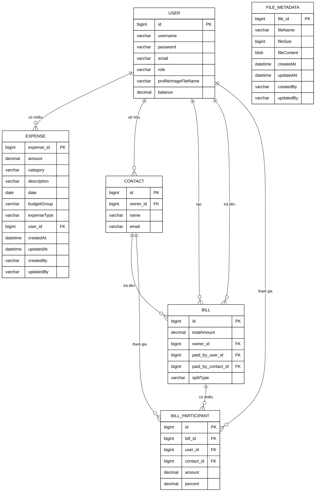

# Biểu đồ ERD - Hệ thống ExpenseWise

## Mô tả
Biểu đồ Entity Relationship Diagram (ERD) cho hệ thống quản lý chi tiêu ExpenseWise.

## Biểu đồ ERD

## Giải thích các Entity

### 1. USER (Người dùng)
- **id**: Khóa chính
- **username**: Tên đăng nhập
- **password**: Mật khẩu
- **email**: Email người dùng
- **role**: Vai trò trong hệ thống
- **profileImageFileName**: Tên file ảnh đại diện
- **balance**: Số dư tài khoản

### 2. EXPENSE (Chi tiêu)
- **expense_id**: Khóa chính
- **amount**: Số tiền
- **category**: Danh mục chi tiêu
- **description**: Mô tả
- **date**: Ngày giao dịch
- **budgetGroup**: Nhóm ngân sách (ESSENTIAL/WANTS/SAVINGS)
- **expenseType**: Loại giao dịch (INCOME/EXPENSE/CASH)
- **user_id**: Khóa ngoại đến USER
- **createdAt, updatedAt, createdBy, updatedBy**: Audit fields

### 3. CONTACT (Danh bạ)
- **id**: Khóa chính
- **owner_id**: Khóa ngoại đến USER (người sở hữu)
- **name**: Tên liên hệ
- **email**: Email liên hệ

### 4. BILL (Hóa đơn)
- **id**: Khóa chính
- **totalAmount**: Tổng số tiền
- **owner_id**: Khóa ngoại đến USER (người tạo)
- **paid_by_user_id**: Khóa ngoại đến USER (người trả tiền)
- **paid_by_contact_id**: Khóa ngoại đến CONTACT (người trả tiền)
- **splitType**: Cách chia tiền (EQUAL/PERCENT/CUSTOM)

### 5. BILL_PARTICIPANT (Người tham gia hóa đơn)
- **id**: Khóa chính
- **bill_id**: Khóa ngoại đến BILL
- **user_id**: Khóa ngoại đến USER
- **contact_id**: Khóa ngoại đến CONTACT
- **amount**: Số tiền phải trả
- **percent**: Phần trăm (nếu chia theo phần trăm)

### 6. FILE_METADATA (Thông tin file)
- **file_id**: Khóa chính
- **fileName**: Tên file
- **fileSize**: Kích thước file
- **fileContent**: Nội dung file (BLOB)
- **createdAt, updatedAt, createdBy, updatedBy**: Audit fields

## Mối quan hệ

1. **USER ↔ EXPENSE**: 1-nhiều (một user có nhiều expense)
2. **USER ↔ CONTACT**: 1-nhiều (một user có nhiều contact)
3. **USER ↔ BILL**: 1-nhiều (một user tạo nhiều bill)
4. **CONTACT ↔ BILL**: 1-nhiều (một contact có thể trả nhiều bill)
5. **BILL ↔ BILL_PARTICIPANT**: 1-nhiều (một bill có nhiều participant)

## Cách tạo hình ảnh từ Mermaid

### Cách 1: Sử dụng Mermaid Live Editor
1. Truy cập: https://mermaid.live/
2. Copy đoạn code mermaid từ file này
3. Paste vào editor
4. Export thành PNG/SVG

### Cách 2: Sử dụng VS Code với Mermaid Extension
1. Cài đặt extension "Mermaid Preview" trong VS Code
2. Mở file này trong VS Code
3. Sử dụng preview để xem biểu đồ
4. Export thành hình ảnh

### Cách 3: Sử dụng GitHub
1. Upload file này lên GitHub
2. GitHub sẽ tự động render biểu đồ Mermaid
3. Screenshot hoặc sử dụng công cụ để lưu hình ảnh

### Cách 4: Sử dụng công cụ online khác
- https://mermaid-js.github.io/mermaid-live-editor/
- https://www.diagrams.net/ (hỗ trợ import Mermaid)
