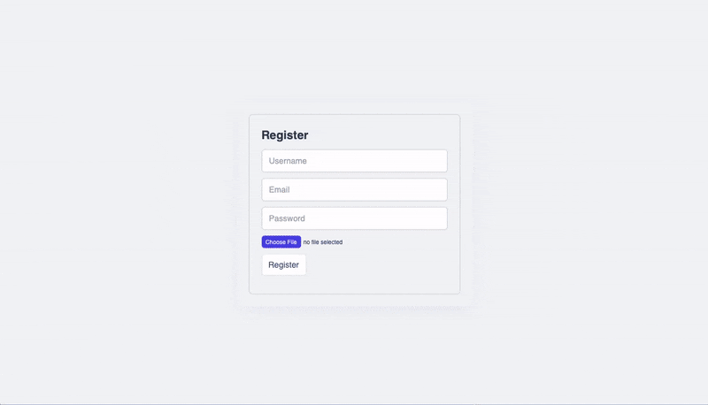

# ExpenseWise — Trình quản lý chi tiêu cá nhân

ExpenseWise là một ứng dụng quản lý chi tiêu cá nhân gồm backend viết bằng Spring Boot và frontend viết bằng React. Ứng dụng giúp người dùng theo dõi, quản lý các khoản chi, phân loại, xem biểu đồ thống kê và quản lý người dùng với phân quyền (RBAC).

### Xem trước



---

## Công nghệ chính

| Frontend                         | Backend                        |
|----------------------------------|--------------------------------|
| React "^18.3.1"                  | Spring Boot 3.3.1              |
| Styled Components "^6.1.11"      | Spring Security 6.3            |
| React Error Boundary "^4.0.13"   | Spring Data JPA                |
| React Hot Toast "^2.4.1"         | spring-boot-starter-validation |
| React Hook Form "^7.51.5"        | Java 17                        |
| Axios "^1.7.2"                   | H2 DB / MySQL                  |
| React Icons "^5.2.1"            | Lombok                         |
| React Modal "^3.16.1"           |                                |
| React Router DOM "^6.23.1"      |                                |
| Recharts "^2.12.7"              |                                |

---

## Tính năng

- Đăng ký / Đăng nhập, phân quyền người dùng (RBAC).
- Bảng điều khiển (Dashboard) hiển thị tổng quan chi tiêu.
- CRUD cho khoản chi và quản lý người dùng.
- Trang hồ sơ người dùng và bảng điều khiển cho admin.
- Biểu đồ dữ liệu (Recharts) để trực quan hóa chi tiêu.
- Chế độ Dark / Light.
- Component UI tái sử dụng.
- Xử lý lỗi toàn cục với React Error Boundary và Global Exception Handler trên backend.
- Validate form bằng React Hook Form.
- Thông báo bằng React Hot Toast.
- Điều hướng bằng React Router DOM.
- Upload file (đã xử lý một số lỗi liên quan multipart).

---


---

## Cấu trúc dự án (tóm tắt)

- backend/ — Spring Boot (API, security, service, repository)
- frontend/ — React (components, pages, services, styles)
- docker-compose.yml — (nếu có) cấu hình xây dựng và chạy các service

(Trong repo có cấu trúc chi tiết hơn trong các thư mục frontend và backend.)

---

## Cài đặt & chạy

Yêu cầu:
- Docker & Docker Compose (đề xuất) hoặc
- Node.js 20+ cho frontend, Java 17 và Maven cho backend, MySQL (nếu không dùng Docker).

1. Clone repository:
   ```bash
   git clone https://github.com/noz-ara/quanlichitieucanhan.git
   cd quanlichitieucanhan
   ```

2. Chạy bằng Docker Compose:
   ```bash
   docker-compose up --build
   ```
   - Frontend mặc định: http://localhost:9000
   - Backend: http://localhost:8080
   - MySQL: port 3307 (nếu cấu hình như vậy trong docker-compose)

3. Dừng các container:
   ```bash
   docker-compose down
   ```

Nếu chạy tách (local):
- Backend:
  - Cấu hình application.properties/application.yml (DB, port, secret JWT...)
  - Chạy bằng Maven: mvn spring-boot:run
- Frontend:
  - Vào thư mục frontend, cài dependencies:
    ```bash
    cd frontend
    npm install
    npm start
    ```
  - Nếu dùng webpack dev-server, đảm bảo historyApiFallback: true để React Router hoạt động.

---

## Biến môi trường quan trọng (ví dụ)

- SPRING_DATASOURCE_URL
- SPRING_DATASOURCE_USERNAME
- SPRING_DATASOURCE_PASSWORD
- SPRING_JPA_HIBERNATE_DDL_AUTO
- JWT_SECRET (nếu dùng JWT)
- FRONTEND_PORT (nếu cấu hình)

(Hãy kiểm tra file cấu hình tương ứng trong backend/frontend để biết tên biến chính xác.)

---

## Vấn đề đã gặp & cách khắc phục (tóm tắt)

Backend
- Too many redirects khi dùng formLogin() — do formLogin phù hợp với ứng dụng server-rendered, đã chuyển sang xử lý API cho frontend.
- Cấu hình CORS — đã cấu hình CORS để cho phép frontend truy cập API.
- Tên bảng/entitiy trùng từ khóa SQL (ví dụ `user`) — đổi tên hoặc escape để tránh xung đột.
- Lỗi upload file (HttpMediaTypeNotSupportedException, multipart) — đã sửa cấu hình multipart và xử lý Content-Type đúng.
- Mapping user trong Expense null — đang fix logic gán user khi tạo expense.

Frontend
- Lỗi redirect với react-router-dom — thêm historyApiFallback trong webpack dev-server.
- Lỗi register input với react-hook-form — đăng ký đúng ref và name cho input.
- Vòng lặp render vô hạn — tách logic fetch user khỏi component login, đặt trong AuthContext với điều kiện phụ thuộc đúng.
- Form không gửi file / preview ảnh không hiển thị — đảm bảo gửi FormData và header không ép Content-Type.

---

## Hướng phát triển (Future work)

- Hoàn thiện OAuth và JWT authentication.
- Thêm chức năng quên mật khẩu (OTP).
- Thêm các API & UI cho chia sẻ chi với bạn bè (split expenses).
- Thêm chỉnh sửa / xóa chi tiêu trong UI.
- Tích hợp test tự động, CI/CD và deploy.
- Bổ sung thông tin tài khoản (balance) trên hồ sơ người dùng.
- Tối ưu hiệu năng và bảo mật.

---

## Khắc phục sự cố (Troubleshooting)

- Kiểm tra logs:
  ```bash
  docker-compose logs
  ```
- Kiểm tra container đang chạy:
  ```bash
  docker ps
  ```
- Kiểm tra backend response bằng curl hoặc Postman (đảm bảo header CORS và Content-Type chính xác).
- Nếu React route trả 404 khi reload trang, bật historyApiFallback trên dev-server hoặc cấu hình server phục vụ index.html.

---

## Đóng góp

Rất hoan nghênh đóng góp! Vui lòng đọc:
- CONTRIBUTING.md
- PR_GUIDELINES.md

Các bước đóng góp cơ bản:
1. Fork repo
2. Tạo branch feature: git checkout -b feat/ten-tinh-nang
3. Commit và push
4. Mở Pull Request mô tả rõ thay đổi

---

## Liên hệ

Nếu có câu hỏi hoặc góp ý, mở issue trên repository:
https://github.com/noz-ara/quanlichitieucanhan

Cảm ơn bạn đã quan tâm tới dự án! 🚀
