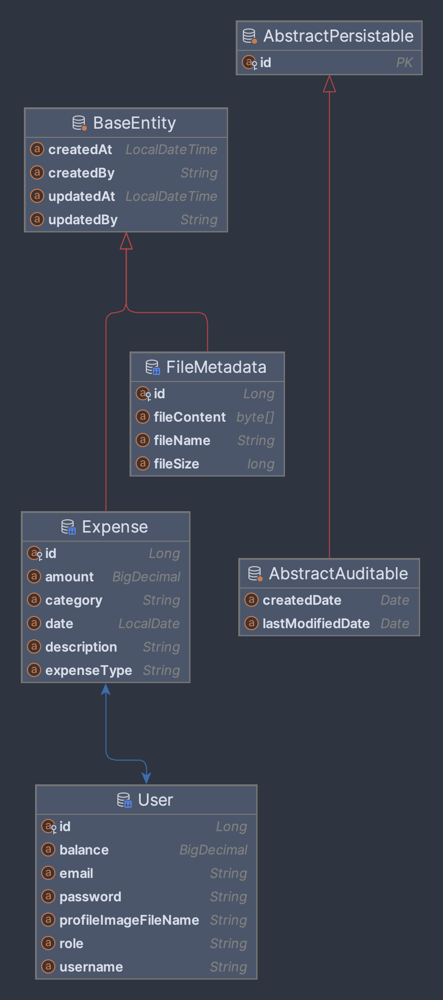

# ExpenseWise

ExpenseWise is a Personal expense tracker, designed to help users manage their expenses efficiently. It consists of a backend built with Spring Boot and a frontend built with React. Authentication and authorization are implemented using Spring Security.

<!-- ## -->

### Preview


### Technologies Used

```markdown
| Frontend                         | Backend                        |
|----------------------------------|--------------------------------|
| React "^18.3.1"                  | Spring Boot 3.3.1              |
| Styled Components: "^6.1.11"     | Spring Security 6.3            |
| React Error Boundary: "^4.0.13"  | Spring Data JPA                |
| React Hot Toast: "^2.4.1"        | spring-boot-starter-validation |
| React Hook Form: "^7.51.5"       | Java 17                        |
| Axios: "^1.7.2"                  | H2 DB -> MySQL                 |
| React Icons: "^5.2.1"            | Lombok                         |
| React Modal: "^3.16.1"           |                                |
| React Router DOM: "^6.23.1"      |                                |
| Recharts: "^2.12.7"              |                                |
```

### Features

- User authentication and authorization using Spring Security.
- RBAC Implementation
- Expense Dashboard
- CRUD operations for managing expenses and users.
- Global Exception Handler
- A Dashboard app with User profile page and admin pannel.
- Data visualization using Recharts.
- Darkmode and lightmode.
- Reusable UI Components.
- Real-time error handling with React Error Boundary.
- Form validation using React Hook Form.
- Toast notifications using React Hot Toast.
- Routing with React Router DOM.
- Styled Components and GlobalStyles for styling.

### ER-Diagram



<!-- This section showcases the Entity-Relationship (ER) diagram for the project. -->
<!-- 
### Project dir. structure

```java
expense-tracker/
.
├── ER-Diag.
├── ER-Diag..png
├── backend
│   ├── HELP.md
│   ├── backend.iml
│   ├── mvnw
│   ├── mvnw.cmd
│   ├── pom.xml
│   ├── src
│   │   ├── main
│   │   │   ├── java
│   │   │   │   └── com
│   │   │   │       └── example
│   │   │   │           └── backend
│   │   │   │               ├── BackendApplication.java
│   │   │   │               ├── ServletInitializer.java
│   │   │   │               ├── controller
│   │   │   │               │   ├── AuthController.java
│   │   │   │               │   ├── ExpenseController.java
│   │   │   │               │   ├── FileController.java
│   │   │   │               │   └── UserController.java
│   │   │   │               ├── dto
│   │   │   │               │   ├── AuthResponse.java
│   │   │   │               │   ├── LoginRequest.java
│   │   │   │               │   └── RegisterRequest.java
│   │   │   │               ├── exception
│   │   │   │               │   └── GlobalExceptionHandler.java
│   │   │   │               ├── model
│   │   │   │               │   ├── BaseEntity.java
│   │   │   │               │   ├── Expense.java
│   │   │   │               │   ├── FileMetadata.java
│   │   │   │               │   └── User.java
│   │   │   │               ├── repository
│   │   │   │               │   ├── ExpenseRepository.java
│   │   │   │               │   ├── FileRepository.java
│   │   │   │               │   └── UserRepository.java
│   │   │   │               ├── security
│   │   │   │               │   ├── CorsConfig.java
│   │   │   │               │   └── SecurityConfig.java
│   │   │   │               ├── service
│   │   │   │               │   ├── CustomUserDetailsService.java
│   │   │   │               │   ├── ExpenseService.java
│   │   │   │               │   ├── FileService.java
│   │   │   │               │   └── FileStorageService.java
│   │   │   │               └── util
│   │   │   │                   └── FileUploadUtil.java
│   │   │   └── resources
│   │   │       ├── application.properties
│   │   │       ├── static
│   │   │       └── templates
│   │   └── test
│   │       
│   └── target
│       ├── classes
│       
├── frontend
│   ├── node_modules
│   ├── package-lock.json
│   ├── package.json
│   ├── public
│   │   ├── default-user.jpg
│   │   ├── faces
│   │   │   ├── avatar.jpg
│   │   │   .
│   │   │   └── toa-heftiba-O3ymvT7Wf9U-unsplash.jpeg
│   │   └── index.html
│   ├── readme.md
│   ├── src
│   │   ├── App.js
│   │   ├── components
│   │   │   ├── auth
│   │   │   │   ├── LoginForm.jsx
│   │   │   │   ├── Logout.js
│   │   │   │   ├── ProtectedRouteContainer.jsx
│   │   │   │   └── RegisterForm.jsx
│   │   │   ├── context
│   │   │   │   ├── AuthContext.js
│   │   │   │   └── DarkModeContext.js
│   │   │   ├── expenses
│   │   │   │   ├── ExpenseForm.jsx
│   │   │   │   ├── ExpenseItem.jsx
│   │   │   │   ├── ExpenseList.jsx
│   │   │   │   └── ExpenseSummary.jsx
│   │   │   ├── features
│   │   │   │   ├── ChartData.js
│   │   │   │   ├── ExpenseActivity.jsx
│   │   │   │   ├── LineChartComponent.jsx
│   │   │   │   ├── PieChartComponent.jsx
│   │   │   │   └── Stats.jsx
│   │   │   ├── hooks
│   │   │   │   ├── useExpenseSummary.js
│   │   │   │   ├── useLocalStorageState.js
│   │   │   │   ├── useMoveBack.js
│   │   │   │   ├── useOutsideClick.js
│   │   │   │   └── useUser.js
│   │   │   ├── pages
│   │   │   │   ├── Dashboard.jsx
│   │   │   │   ├── Expenses.jsx
│   │   │   │   ├── Login.jsx
│   │   │   │   ├── PageNotFound.jsx
│   │   │   │   ├── SplitBill.jsx
│   │   │   │   ├── UserProfile.jsx
│   │   │   │   └── users.jsx
│   │   │   ├── service
│   │   │   │   ├── ExpenseService.js
│   │   │   │   └── UserService.js
│   │   │   ├── split-bills
│   │   │   │   ├── AddFriend.jsx
│   │   │   │   ├── Friend.jsx
│   │   │   │   ├── FriendsList.jsx
│   │   │   │   └── SplitBillForm.jsx
│   │   │   ├── styles
│   │   │   │   └── GlobalStyles.js
│   │   │   ├── ui
│   │   │   │   ├── AppLayout.jsx
│   │   │   │   .
│   │   │   │   .
│   │   │   │   .
│   │   │   │   ├── UserAvatar.jsx
│   │   │   │   └── index.js
│   │   │   └── utils
│   │   │       └── helpers.js
│   │   └── index.js
│   └── webpack.config.js
└── readme.md

2282 directories, 19371 files
``` -->

<!-- Creating this app involves several steps, including setting up the backend and frontend, implementing the necessary features, and connecting them. Here's a high-level overview of the process: -->

<!-- ### Steps to Set Up the Application

1. **Set Up Backend with Spring Boot:**
   - Initialize a Spring Boot project with necessary dependencies.
   - Configure Spring Security OAuth2 for authentication.
   - Create RESTful APIs for CRUD operations on expenses.

2. **Set Up Frontend with React:**
   - Initialize a React project and install dependencies.
   - Create components for managing expenses.
   - Integrate Axios for API requests and styled-components for styling.

3. **Connect Backend and Frontend:**
   - Implement API integration using Fetch/Axios to communicate with the backend.
   - Integrate OAuth2 authentication flow in the frontend.

4. **Authentication Flow:**
   - Users authenticate through the frontend, which sends requests to the backend.
   - Backend verifies credentials and issues access tokens for authenticated users. -->

### Issues Faced and Resolutions

Here are some of the issues I faced during creating this project and how I resolved them:

**Backend Issues**

- **Redirect Issue**: After connecting to the React login endpoint, I encountered too many redirects because I was using `formLogin()` in Spring Security, which is intended for Thymeleaf or other Spring views, not for React.
- **CORS Configuration**: Addressed by configuring CORS settings in the backend to allow requests from the frontend.
- **SQL Reserved Keyword**: Was named an entity as "user" but found that it's a reserved keyword in SQL. Avoided using reserved keywords like "user" for entity names to prevent conflicts.
- **File-upload issues**: Encountered an `HttpMediaTypeNotSupportedException` and `multipart` file error while attempting to upload files. Fixed them all.
- **User mapping issue**: Encountered a user mapping issue in expenses where user is null. Currentlly fixing it.

**Frontend Issues**

- **React Redirect Issue**: `react-router-dom` requires proper configuration in webpack. You need to set `historyApiFallback: true` in the dev-server to enable routing functionality correctly. It redirects all requests to the root URL (e.g., /) so that React Router can handle them.
- **react-hhok-form issues**: Was facing issues with registering inputs fixed it.
- **Handling User Data:** Faced uncertainty about where to manage user data and how to integrate it with authentication.
- **Resolved Infinite Render Loop:** Initially encountered an infinite render loop due to incorrect logic, trying to fetch and set user details in the AuthContext directly from the `LoginForm`. Rectified by separating concerns: `LoginForm` handles authentication, setting user ID, while `useUser()` hook independently fetches user details.
- **React form issue**: React form data was not including file data and image preview was not showing.

<!-- ### Authentication flow in details

- User enters credentials in the React frontend and submits the login form.
- The frontend sends a POST request to a login endpoint in the Spring Boot backend.
- The backend validates the credentials and generates a JWT token.
- The backend sends the JWT token back to the frontend.
- The frontend stores the JWT token securely.
- Subsequent requests from the frontend to secured endpoints include the JWT token in the request headers for authentication.
- The backend verifies the JWT token for each secured request. -->

### Future Work

- Implement OAuth and JWT authentication
- Add forgot password functionality with OTP verification
- Set up testing, deployment, and CI/CD pipelines
- Implement backend for split expenses with friends and connect it with expenses
- Update user profile to include balance and other relevant information
- Add options for editing and deleting expenses
- Explore additional features and improvements

### Steps to Run the Project

Ensure you have Docker and Docker Compose installed on your system.

1. **Clone the Repository:**

   ```bash
   git clone https://github.com/yourusername/yourproject.git
   cd yourproject
   ```

2. **Build and Run the Containers:**

   ```bash
   docker-compose up --build
   ```

   This will build the frontend, backend, and MySQL services, and start them up.

3. **Access the Application:**
   - **Frontend:** Visit `http://localhost:9000` in your browser.
   - **Backend:** The backend service runs on `http://localhost:8080`.
   - **Database:** MySQL is exposed on port `3307`.

4. **Shut Down the Containers:**

   ```bash
   docker-compose down
   ```

   This will stop and remove the containers.

### Troubleshooting

If you encounter any issues, check the container logs:

```bash
docker-compose logs
```

Ensure all services are up and running:

```bash
docker ps
```

### Notes

- The frontend is built using Node.js 20 and served with Nginx.
- The backend is built with Maven and runs on OpenJDK 17.
- The MySQL database is initialized with the `expenses` database.

## Contributing

To contribute to this project, please review our [Contributing](CONTRIBUTING.md) and [Pull Request Guidelines](PR_GUIDELINES.md) for detailed instructions on how to create and manage pull requests.

Feel free to explore the code and contribute if you'd like! If you have any questions or feedback, please don't hesitate to reach out.

Thank you for checking out my projects! 🚀
